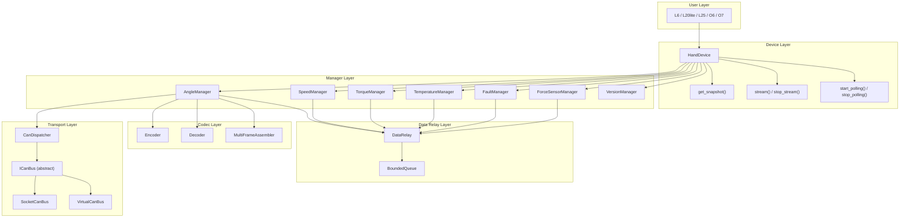
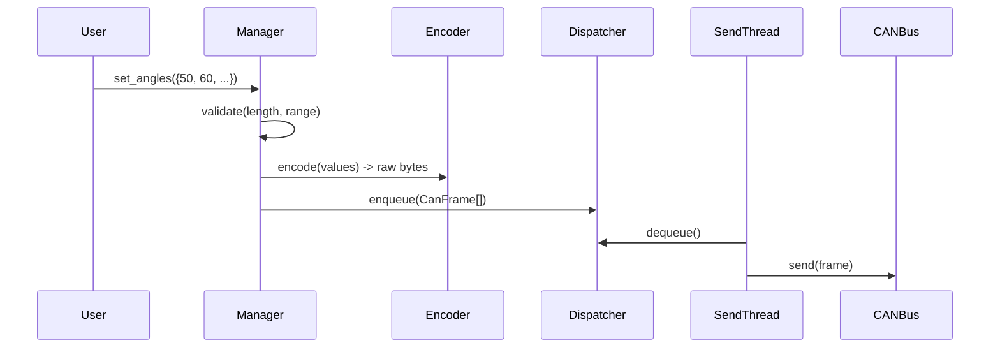
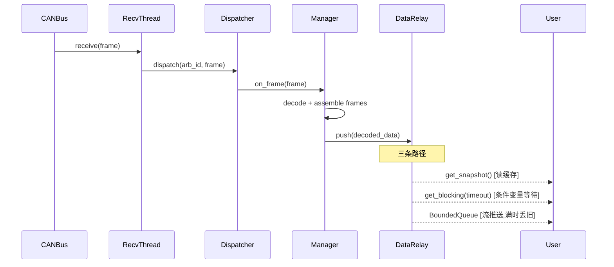
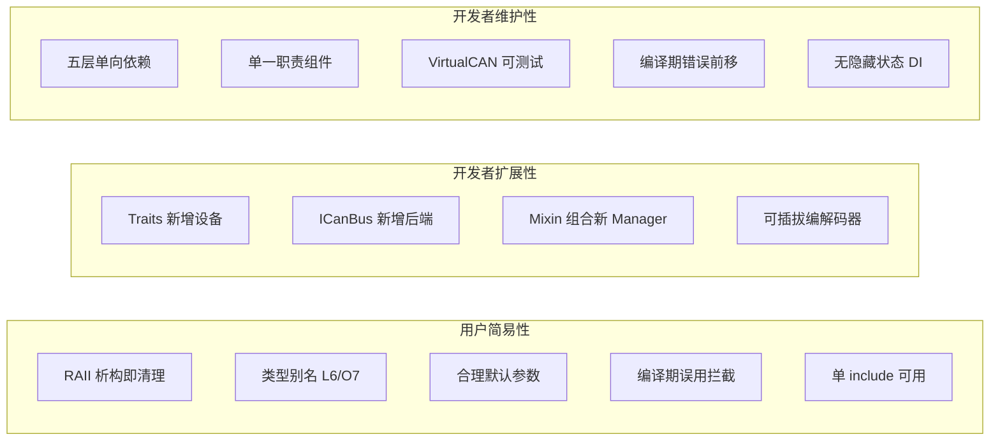

# Linkerbot C++ SDK 架构设计

## 0. 三大设计目标

### 目标一：用户使用的简易性

SDK 的终端用户（机器人应用开发者）应当能以最少的认知负担完成工作。

**用户需要知道的概念（仅 7 个）**：

1. 设备类型名（L6 / O7 / ...）
2. HandType（Left / Right）
3. Manager 名（angle / speed / torque / ...）
4. 三个动词（set / get_blocking / get_snapshot）
5. start_polling / stream（高级用法）
6. SensorEvent（流事件）
7. 三种异常（Timeout / Validation / State）

**用户不需要知道的（全部隐藏）**：

- shared_ptr / ICanBus / CanDispatcher / CanFrame
- DataRelay / BoundedQueue / MultiFrameAssembler
- DeviceTraits / Concepts / Mixin
- Encoder / Decoder / 指令码

```cpp
// 用户完整使用示例（极简 API）
#include <linkerbot/linkerbot.hpp>
using namespace linkerbot;

// 一行构造（bus 创建被隐藏）
L6 hand("can0", HandType::Right);

hand.angle().set_angles({50, 60, 70, 80, 90, 100});
auto angles = hand.angle().get_blocking();         // 默认 1000ms
auto cached  = hand.angle().get_snapshot();         // std::optional

// 流式读取
hand.start_polling();
for (auto& event : hand.stream()) {
    if (event.is_angle()) {
        auto vals = event.values();  // std::span<const double>
    }
}
// 离开作用域自动清理
```

### 目标二：开发者的可扩展性

SDK 的维护开发者能以最小改动应对变化：

- **新增设备型号**：只需新增一个 `XxxTraits` 结构体 + 一行 `using` 别名，不改任何现有代码（OCP）
- **新增 CAN 后端**：只需实现 `ICanBus` 接口（`detail/` 内部），不改调度器或 Manager 代码（DIP）
- **新增 Manager 类型**：组合 `ReadableMixin` / `WritableMixin` 即可，策略自由混搭
- **自定义解码器**：Traits 可携带自定义编解码函数，不同设备可有不同数据转换逻辑

注意：扩展 API（ICanBus、Traits）属于开发者级别，放在 `detail/` 中，不出现在用户主 include 路径中。

扩展示例 -- 假设未来新增 L30 设备：

```cpp
// 开发者在 detail/ 内部操作
// 1. 定义特征（一个文件，约 30 行）
struct L30Traits {
    static constexpr std::string_view name = "L30";
    static constexpr uint8_t joint_count = 20;
    static constexpr bool has_speed_read = true;
    static constexpr bool has_current = false;
    static constexpr bool has_acceleration = true;
    // ... 指令码定义 ...
};

// 2. 公开给用户的类型别名
using L30 = HandDevice<L30Traits>;

// 完成。无需修改 HandDevice、Manager、DataRelay 的任何代码。
```

### 目标三：开发者的可维护性

代码在长期演进中保持清晰可控：

- **分层解耦**：Transport / Codec / DataRelay / Manager / Device 五层单向依赖，每层可独立测试
- **单一职责**：DataRelay 只管三模式读写，FrameAssembler 只管多帧组装，Manager 只管业务映射
- **编译期保障**：Concepts + `if constexpr` 把错误前移到编译阶段，减少运行时调试
- **可测试性**：VirtualCanBus 注入后，所有层级可在无硬件环境下单元测试
- **无隐藏状态**：不用 Singleton，所有依赖通过构造函数显式传入

---

## 1. 设计原则与模式选择

### 应用的模式（有真实问题驱动）

- **Strategy 模式（ICanBus）**：CAN 后端需运行时切换（SocketCAN / PCAN / 虚拟测试），3+ 变体，经典策略模式场景 -> **服务于扩展性**
- **Observer 模式（DataRelay -> Stream）**：一对多事件通知，解耦数据生产与消费 -> **服务于维护性**
- **Policy-based Design（Manager Mixin）**：编译期组合读/写/流能力，C++ 惯用法 -> **服务于扩展性 + 维护性**
- **RAII（生命周期管理）**：析构自动清理线程/流/连接 -> **服务于用户简易性**
- **编译期特征（DeviceTraits + Concepts）**：能力差异在编译期解决 -> **服务于用户简易性 + 维护性**

### 不使用的模式（避免过度设计）

- **不用 Singleton**：CAN 连接通过构造函数注入（DI），可测试，符合 DIP
- **不用 Builder**：设备构造参数少（bus + hand_type），不需要
- **不用 Abstract Factory**：用户明确知道目标设备类型，不存在运行时类型选择

### 核心 C++ 特性利用

- `constexpr` + Traits：设备指令码/关节数/能力矩阵 -> 零运行时开销
- `if constexpr`：按设备特征条件编译 Manager -> 消除不支持能力的代码
- Concepts (C++20)：`Readable` / `Writable` / `Streamable` 约束 -> 编译期清晰错误信息
- `std::jthread` + `stop_token`：轮询/收发线程 -> 协作式取消，自动 join
- RAII：设备/流/线程生命周期 -> 析构即清理
- `std::shared_mutex`：DataRelay 快照读写 -> 多读者单写者
- `std::variant`：统一流事件类型 -> 类型安全
- `std::optional`：快照初始值 -> 表达"尚无数据"
- `std::span`：CAN 帧数据视图 -> 零拷贝
- `std::expected` (C++23)：可恢复错误 -> 异常/返回值双轨 API

---

## 2. 总体架构




---

## 3. 数据流设计

### 写入路径（set）




### 读取路径（blocking / snapshot / stream）




---

## 4. 关键组件设计

### 4.1 DeviceTraits — 编译期设备差异化

每个设备类型定义一个 Traits struct，用 `constexpr` 描述全部差异：

```cpp
// include/linkerbot/device/traits/l6_traits.hpp
struct L6Traits {
    static constexpr std::string_view name = "L6";
    static constexpr uint8_t joint_count = 6;
    
    // 能力标志（编译期）
    static constexpr bool has_speed_read = false;    // speed 只写
    static constexpr bool has_current = true;         // 独有
    static constexpr bool has_acceleration = false;
    static constexpr bool has_fault_clear = true;
    static constexpr bool fault_in_stream = true;
    
    // 指令码序列（数组大小 = 帧数）
    static constexpr std::array cmd_angle = {uint8_t{0x01}};
    static constexpr std::array cmd_torque = {uint8_t{0x02}};
    static constexpr std::array cmd_speed = {uint8_t{0x05}};
    static constexpr std::array cmd_temperature = {uint8_t{0x33}};
    static constexpr std::array cmd_current = {uint8_t{0x36}};
    static constexpr std::array cmd_fault = {uint8_t{0x35}};
    static constexpr uint8_t cmd_fault_clear = 0x83;
    
    // 力传感维度
    static constexpr size_t force_rows = 12;
    static constexpr size_t force_cols = 6;
};
```

L25 的多帧特征自然表达为：

```cpp
struct L25Traits {
    static constexpr std::array cmd_angle = {
        uint8_t{0x41}, uint8_t{0x42}, uint8_t{0x43}, uint8_t{0x44}, uint8_t{0x45}
    };
    // frame_count = cmd_angle.size() = 5, 编译期确定
};
```

### 4.2 Concepts — 编译期能力约束

```cpp
// include/linkerbot/concepts.hpp
template <typename T>
concept HasSpeedRead = requires { requires T::has_speed_read == true; };

template <typename T>
concept HasAcceleration = requires { requires T::has_acceleration == true; };

template <typename T>
concept HasCurrent = requires { requires T::has_current == true; };

template <typename T>
concept HasFaultClear = requires { requires T::has_fault_clear == true; };
```

作用：在 `HandDevice<Traits>` 中用 `if constexpr` + concepts 控制 Manager 的存在性，**不支持的能力在编译期就不存在**。

### 4.3 DataRelay — 三模式读取的核心

```cpp
// include/linkerbot/core/data_relay.hpp
template <typename T>
class DataRelay {
public:
    std::optional<T> snapshot() const {
        std::shared_lock lock(mutex_);
        return cached_;
    }

    T wait(std::chrono::milliseconds timeout) {
        std::unique_lock lock(mutex_);
        if (!cv_.wait_for(lock, timeout, [&] { return fresh_; }))
            throw TimeoutError("DataRelay::wait timed out");
        fresh_ = false;
        return *cached_;
    }

    void push(T value) {
        {
            std::unique_lock lock(mutex_);
            cached_ = std::move(value);
            fresh_ = true;
        }
        cv_.notify_all();
        notify_sinks(*cached_);
    }

private:
    mutable std::shared_mutex mutex_;
    std::condition_variable_any cv_;
    std::optional<T> cached_;
    bool fresh_ = false;
    // sink 管理（weak_ptr 避免悬垂）
    std::vector<std::weak_ptr<BoundedQueue<SensorEvent>>> sinks_;
};
```

### 4.4 BoundedQueue — 丢弃最旧策略

```cpp
// include/linkerbot/stream/bounded_queue.hpp
template <typename T>
class BoundedQueue {
public:
    explicit BoundedQueue(size_t capacity);
    
    void push(T value) {
        std::lock_guard lock(mutex_);
        if (buffer_.size() >= capacity_)
            buffer_.pop_front();  // 丢弃最旧
        buffer_.push_back(std::move(value));
        cv_.notify_one();
    }
    
    // 迭代器接口，支持 range-for
    std::optional<T> try_pop(std::chrono::milliseconds timeout);
    
    // 支持 stop_token 取消
    std::optional<T> pop(std::stop_token stoken);
};
```

### 4.5 MultiFrameAssembler<N, DataSize> — 多帧组装

```cpp
// include/linkerbot/codec/frame_assembler.hpp
template <size_t FrameCount, size_t DataPerFrame = 6>
class MultiFrameAssembler {
public:
    // 返回 std::optional，仅当所有帧齐全时返回完整数据
    std::optional<std::array<uint8_t, FrameCount * DataPerFrame>>
    feed(size_t frame_index, std::span<const uint8_t> data) {
        frames_[frame_index] = true;
        std::copy(data.begin(), data.end(), 
                  buffer_.begin() + frame_index * DataPerFrame);
        if (all_received()) {
            reset();
            return buffer_;
        }
        return std::nullopt;
    }
    
    // 节流控制
    bool is_throttled() const;
    
private:
    std::bitset<FrameCount> frames_;
    std::array<uint8_t, FrameCount * DataPerFrame> buffer_;
    std::chrono::steady_clock::time_point last_complete_;
    static constexpr auto throttle_window = std::chrono::milliseconds(200);
};
```

### 4.6 HandDevice — 设备入口（双层构造 + 统一 speed API）

```cpp
// include/linkerbot/detail/hand_device_impl.hpp  (内部)
template <typename Traits>
class HandDevice {
public:
    // === 用户层构造：隐藏 bus 创建 ===
    HandDevice(std::string_view can_channel, HandType hand)
        : HandDevice(
              std::make_shared<detail::SocketCanBus>(can_channel),
              hand
          ) {}

    // === 高级构造：自定义 bus（开发者/测试用） ===
    explicit HandDevice(std::shared_ptr<detail::ICanBus> bus, HandType hand)
        : dispatcher_(std::move(bus), hand == HandType::Right ? 0x27 : 0x28)
        , angle_(dispatcher_)
        , speed_(dispatcher_)       // SpeedManager 统一存在
        , torque_(dispatcher_)
        , temperature_(dispatcher_)
        , fault_(dispatcher_)
        , force_sensor_(dispatcher_)
        , version_(dispatcher_)
    {
        if constexpr (Traits::has_current)
            current_.emplace(dispatcher_);
        if constexpr (Traits::has_acceleration)
            acceleration_.emplace(dispatcher_);
    }
    
    ~HandDevice() { close(); }
    
    HandDevice(const HandDevice&) = delete;
    HandDevice& operator=(const HandDevice&) = delete;
    HandDevice(HandDevice&&) noexcept = default;
    
    // === Manager 访问（所有设备都有的） ===
    auto& angle()        { check_open(); return angle_; }
    auto& speed()        { check_open(); return speed_; }
    auto& torque()       { check_open(); return torque_; }
    auto& temperature()  { check_open(); return temperature_; }
    auto& fault()        { check_open(); return fault_; }
    auto& force_sensor() { check_open(); return force_sensor_; }
    auto& version()      { check_open(); return version_; }
    
    // === 条件 Manager（编译期保护） ===
    auto& current()      requires HasCurrent<Traits>      { check_open(); return *current_; }
    auto& acceleration() requires HasAcceleration<Traits>  { check_open(); return *acceleration_; }
    
    // === 统一快照/流/轮询 ===
    Snapshot get_snapshot() const;
    
    StreamHandle stream();
    void stop_stream();
    
    void start_polling(std::chrono::milliseconds interval = std::chrono::milliseconds{50});
    void stop_polling();
    
    void close();
    bool is_closed() const;

private:
    void check_open() const {
        if (closed_) throw StateError("device is closed");
    }
    
    detail::CanDispatcher dispatcher_;
    AngleManager<Traits> angle_;
    SpeedManager<Traits> speed_;           // 统一类型：内部按 Traits 决定有无 read
    TorqueManager<Traits> torque_;
    TemperatureManager<Traits> temperature_;
    FaultManager<Traits> fault_;
    ForceSensorManager<Traits> force_sensor_;
    VersionManager<Traits> version_;
    
    std::optional<CurrentManager<Traits>> current_;
    std::optional<AccelerationManager<Traits>> acceleration_;
    
    std::optional<std::jthread> polling_thread_;
    std::atomic<bool> closed_{false};
};
```

**关键改进：speed 统一 API**

`SpeedManager<Traits>` 对所有设备都存在，但内部按 `Traits::has_speed_read` 控制方法可用性：

```cpp
template <typename Traits>
class SpeedManager {
public:
    // 所有设备都有 set
    void set_speeds(std::span<const double> values);
    
    // 仅 has_speed_read 设备有 get（编译期控制）
    auto get_blocking(std::chrono::milliseconds timeout = 1000ms)
        requires (Traits::has_speed_read);
    
    auto get_snapshot() const
        requires (Traits::has_speed_read);
};

// 用户代码：
L6 hand("can0", HandType::Right);
hand.speed().set_speeds({50, 60, 70, 80, 90, 100});   // OK
// hand.speed().get_blocking();  // CE: L6Traits::has_speed_read == false
//                               // 编译器提示: "constraint not satisfied"

O7 hand2("can0", HandType::Right);
hand2.speed().get_blocking();  // OK: O7 支持 speed 读取
```

### 4.7 类型别名 — 用户唯一接触的类型

```cpp
// include/linkerbot/l6.hpp  (公开头文件，极短)
#pragma once
#include <linkerbot/detail/hand_device_impl.hpp>
#include <linkerbot/detail/traits/l6_traits.hpp>
namespace linkerbot {
using L6 = detail::HandDevice<detail::L6Traits>;
}

// 用户代码：
#include <linkerbot/linkerbot.hpp>
using namespace linkerbot;

L6 hand("can0", HandType::Right);  // 一行构造，无需 shared_ptr

hand.angle().set_angles({50, 60, 70, 80, 90, 100});
auto angles = hand.angle().get_blocking();   // 默认 1000ms
auto snapshot = hand.get_snapshot();
```

### 4.8 Transport Layer — 全部在 detail 内（用户不可见）

```cpp
// include/linkerbot/detail/can_bus.hpp  (内部)
namespace linkerbot::detail {

class ICanBus {
public:
    virtual ~ICanBus() = default;
    virtual void send(const CanFrame& frame) = 0;
    virtual std::optional<CanFrame> receive(std::chrono::milliseconds timeout) = 0;
};

class CanDispatcher { /* ... 同前 ... */ };

} // namespace linkerbot::detail
```

用户完全看不到 `ICanBus`、`CanFrame`、`CanDispatcher`。高级用户（需要自定义 CAN 后端）可通过 `#include <linkerbot/advanced/can_bus.hpp>` 显式引入。

### 4.9 错误体系

```cpp
// include/linkerbot/error/errors.hpp
class SdkError : public std::runtime_error { using runtime_error::runtime_error; };
class ValidationError : public SdkError { using SdkError::SdkError; };
class TimeoutError : public SdkError { using SdkError::SdkError; };
class StateError : public SdkError { using SdkError::SdkError; };
```

### 4.10 SensorEvent — 对用户友好的事件接口（隐藏 variant）

```cpp
// include/linkerbot/types.hpp  (公开)
namespace linkerbot {

enum class SensorSource : uint8_t {
    Angle, Speed, Torque, Temperature, Current, Acceleration, Fault, ForceSensor
};

// 力传感矩阵 — 有语义的封装（替代裸 vector<vector<uint8_t>>）
class ForceMatrix {
public:
    size_t rows() const;
    size_t cols() const;
    uint8_t operator()(size_t row, size_t col) const;
    std::span<const uint8_t> row(size_t i) const;
private:
    std::vector<uint8_t> data_;  // 扁平存储
    size_t rows_, cols_;
};

// 用户友好的事件类型 — 不暴露 std::variant
class SensorEvent {
public:
    SensorSource source() const;
    std::chrono::steady_clock::time_point timestamp() const;
    
    // 类型检查
    bool is_angle() const;
    bool is_speed() const;
    bool is_torque() const;
    bool is_temperature() const;
    bool is_current() const;
    bool is_acceleration() const;
    bool is_fault() const;
    bool is_force_sensor() const;
    
    // 类型安全的数据访问（无需 std::get/std::visit）
    std::span<const double>  values() const;       // angle/speed/torque/temp/current/accel
    std::span<const uint8_t> faults() const;       // fault codes
    const ForceMatrix&       force_matrix() const; // force sensor
    
private:
    // variant 隐藏在 private 中，用户永远不接触
    SensorSource source_;
    std::chrono::steady_clock::time_point ts_;
    std::variant<
        std::vector<double>,
        std::vector<uint8_t>,
        ForceMatrix
    > data_;
};

} // namespace linkerbot
```

**用户代码对比**：

```cpp
// 旧（暴露 variant）：用户需要掌握 std::get/std::visit
auto& vals = std::get<std::vector<double>>(event.data);

// 新（隐藏 variant）：直觉式访问
if (event.is_angle()) {
    auto vals = event.values();  // std::span<const double>
}
// 或用 source() switch
switch (event.source()) {
    case SensorSource::Angle:
        process(event.values());
        break;
    case SensorSource::ForceSensor:
        auto& mat = event.force_matrix();
        for (size_t i = 0; i < mat.rows(); ++i)
            process_row(mat.row(i));
        break;
}
```

---

## 5. 目录结构（公开 vs 内部 分离）

```
linkerbot-sdk/
+-- CMakeLists.txt
+-- include/
|   +-- linkerbot/
|       |
|       |  ===== 公开头文件（用户可 include）=====
|       +-- linkerbot.hpp          # umbrella: include 所有设备类型 + types + errors
|       +-- types.hpp              # HandType, SensorSource, SensorEvent, ForceMatrix, Snapshot
|       +-- errors.hpp             # ValidationError, TimeoutError, StateError
|       +-- l6.hpp                 # using L6 = detail::HandDevice<detail::L6Traits>;
|       +-- l20lite.hpp            # using L20lite = ...
|       +-- l25.hpp                # using L25 = ...
|       +-- o6.hpp                 # using O6 = ...
|       +-- o7.hpp                 # using O7 = ...
|       |
|       |  ===== 高级头文件（自定义 CAN 后端 / 测试用）=====
|       +-- advanced/
|       |   +-- can_bus.hpp        # ICanBus 接口 (开发者扩展点)
|       |   +-- virtual_can.hpp    # VirtualCanBus (测试用)
|       |
|       |  ===== 内部实现（用户不应直接 include）=====
|       +-- detail/
|           +-- can_frame.hpp
|           +-- can_bus_impl.hpp
|           +-- can_dispatcher.hpp
|           +-- data_relay.hpp
|           +-- bounded_queue.hpp
|           +-- stream_handle.hpp
|           +-- encoder.hpp
|           +-- decoder.hpp
|           +-- frame_assembler.hpp
|           +-- concepts.hpp
|           +-- readable_mixin.hpp
|           +-- writable_mixin.hpp
|           +-- hand_device_impl.hpp
|           +-- manager/
|           |   +-- angle_manager.hpp
|           |   +-- speed_manager.hpp
|           |   +-- torque_manager.hpp
|           |   +-- temperature_manager.hpp
|           |   +-- current_manager.hpp
|           |   +-- fault_manager.hpp
|           |   +-- force_sensor_manager.hpp
|           |   +-- version_manager.hpp
|           +-- traits/
|               +-- l6_traits.hpp
|               +-- l20lite_traits.hpp
|               +-- l25_traits.hpp
|               +-- o6_traits.hpp
|               +-- o7_traits.hpp
+-- src/
|   +-- can_dispatcher.cpp
|   +-- encoder.cpp
|   +-- decoder.cpp
|   +-- socket_can_bus.cpp
|   +-- virtual_can_bus.cpp
+-- tests/
|   +-- test_data_relay.cpp
|   +-- test_frame_assembler.cpp
|   +-- test_codec.cpp
|   +-- test_bounded_queue.cpp
|   +-- test_managers.cpp
|   +-- test_l6.cpp / test_o7.cpp / ...
+-- examples/
    +-- basic_control.cpp
    +-- streaming.cpp
    +-- multi_device.cpp
```

**用户视角的 include 路径**（只有 7 个公开头文件）：

```cpp
#include <linkerbot/linkerbot.hpp>    // 全部引入（推荐）
// 或按需引入：
#include <linkerbot/l6.hpp>           // 只要 L6
#include <linkerbot/types.hpp>        // 只要类型定义
#include <linkerbot/errors.hpp>       // 只要异常类型
```

**开发者/测试视角**（需要高级 API 时）：

```cpp
#include <linkerbot/advanced/can_bus.hpp>      // ICanBus 接口
#include <linkerbot/advanced/virtual_can.hpp>  // 测试用虚拟 CAN
```

`detail/` 下的头文件虽然技术上可 include，但通过命名约定（`detail` = "勿直接使用"）和文档明确告知用户不要依赖。

---

## 6. 五机型能力差异矩阵（编译期实现）


| 能力              | L6   | L20lite | L25  | O6   | O7   |
| --------------- | ---- | ------- | ---- | ---- | ---- |
| speed read      | -    | Y       | Y    | Y    | Y    |
| current         | Y    | -       | -    | -    | -    |
| acceleration    | -    | -       | -    | Y    | Y    |
| fault clear     | Y    | -       | Y    | -    | -    |
| fault in stream | Y    | -       | Y    | Y    | Y    |
| 帧数(angle)       | 1    | 2       | 5    | 1    | 1    |
| force shape     | 12x6 | 12x6    | 12x6 | 10x4 | 12x6 |
| 关节数             | 6    | 10      | 16   | 6    | 7    |


所有差异通过 `Traits` 的 `constexpr` 成员在编译期确定，不存在运行时分支。

---

## 7. 构建配置

- **C++ 标准**：C++20（Concepts, jthread, constexpr 增强），部分用 C++23（std::expected）
- **构建系统**：CMake 3.20+
- **依赖**：linux-can/socketcan-utils（SocketCAN 后端）、GoogleTest（测试）
- **编译器**：GCC 12+ / Clang 15+ / MSVC 2022+
- **库类型**：header-mostly（模板/内联为主），少量 .cpp 编译为静态库

---

## 8. 设计决策与三大目标映射




| 设计决策                              | 用户简易性      | 扩展性          | 维护性       | 设计模式/原则            |
| --------------------------------- | ---------- | ------------ | --------- | ------------------ |
| `using L6 = HandDevice<L6Traits>` | 两行代码启动     | 新设备只加 Traits | -         | OCP                |
| `ICanBus` 抽象接口                    | -          | 新后端只实现接口     | 层间解耦      | Strategy + DIP     |
| `ReadableMixin` / `WritableMixin` | -          | 自由组合能力       | 单一职责      | Policy-based + SRP |
| `DataRelay<T>` 模板                 | 三种读模式统一    | -            | 独立可测试     | Observer + SRP     |
| RAII 生命周期                         | 无需手动 close | -            | 异常安全      | RAII idiom         |
| `requires` 子句                     | 编译报错而非崩溃   | -            | 减少运行时 bug | Concepts + PoLA    |
| 构造函数注入                            | -          | 可替换实现        | 可 mock 测试 | DIP (不用 Singleton) |
| `constexpr` 能力矩阵                  | -          | 新设备声明式描述     | 零散逻辑集中化   | 编译期计算              |
| 五层架构分离                            | API 表面极小   | 每层独立扩展       | 独立测试/替换   | SoC + ISP          |


### 用户 API 设计守则

1. **最少惊讶原则 (PoLA)**：API 命名与 Python SDK 保持一致（`set_angles` / `get_blocking` / `get_snapshot`），降低迁移成本
2. **渐进式复杂度**：基础用法 5 行代码搞定；高级用法（流/轮询/自定义超时）按需引入
3. **编译期而非运行时报错**：不支持的操作在编译阶段阻止，错误信息通过 Concepts 可读化
4. **零配置默认值**：`get_blocking()` 默认 1000ms 超时，`BoundedQueue` 默认 64 容量，`polling` 默认 50ms 间隔

### 扩展点清单（开发者文档）


| 扩展场景              | 需要做什么                                                | 需要改什么现有代码       |
| ----------------- | ---------------------------------------------------- | --------------- |
| 新增设备型号（如 L30）     | 新增 `L30Traits` + `using L30 = HandDevice<L30Traits>` | 无               |
| 新增 CAN 后端（如 PCAN） | 实现 `ICanBus` 接口                                      | 无               |
| 新增 Manager 类型     | 继承 Mixin + 注册到 HandDevice                            | HandDevice 加成员  |
| 修改数据编码规则          | 修改 Traits 中的 codec 函数                                | 无               |
| 新增流事件类型           | 扩展 `SensorEvent` variant                             | SensorEvent 加类型 |


**核心原则**：新增设备/后端是最高频的扩展需求，这两个场景都满足 OCP -- 零修改现有代码。